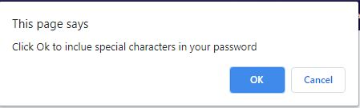

My Password Generator

Description
This website is a password generator. The user can get a combination of generated characters that can be use as their new password. They can choose the password length between 8 to 128. They can have it contains special, numeric or upper cased characters.

Installation
Open the website address with your desired web browser

Usage

Click on the "Generate Password" to begin the first step of getting a new randomize password

Enter the desired length of your new password. Must be at least 8 and less than 128 characters

Click "Ok" if you want special characters to be included in your password. Click "Cancel" if otherwise

Click "Ok" if you want numeric characters to be included in your password. Click "Cancel" if otherwise

Click "Ok" if you want lower cased characters to be included in your password. Click "Cancel" if otherwise

Click "Ok" if you want upper cased characters to be included in your password. Click "Cancel" if otherwise

Your new password should appear in the box

Credits

https://developer.mozilla.org/en-US/docs/Web/JavaScript/Reference/Global_Objects/String
https://www.youtube.com/watch?v=9sT03jEwcaw&feature=emb_logo
https://stackoverflow.com/questions/1497481/javascript-password-generator

License

